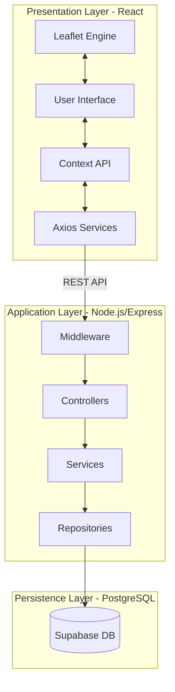

# Elevé: Advanced Residential Discovery Platform

[Live Demo](https://apartmentsearch.vercel.app/)

Elevé is a sophisticated full-stack residential discovery application designed for high-precision geographic property searches. The platform integrates an interactive geospatial mapping interface with a curated property database, providing users with real-time availability, detailed amenity breakdowns, and localized proximity analysis for essential services.

---

## Core Functionality

### Geospatial Mapping and Navigation
The application utilizes a custom Leaflet-based mapping engine that renders property listings as interactive price-markers. The map supports dynamic tile-layer switching synchronized with the application's theme system and implements real-time coordinate-based filtering.

### Advanced Search and Filtering
Users can perform granular searches based on multiple parameters, including price ranges, bedroom configurations (BHK), and specific amenities. The filtering system is executed through a reactive UI that triggers server-side query optimizations.

### Comprehensive Property Profiles
Each listing provides an extensive data dossier, including high-resolution image galleries, detailed specifications, and a proximity report generated via geospatial analysis of nearby Points of Interest (POIs) such as schools, hospitals, and transit hubs.

### Secure Authentication and Session Management
The platform implements a stateless JWT (JSON Web Token) authentication architecture. It features a dual-token system (Access and Refresh tokens) with secure httpOnly cookie storage, ensuring robust protection against common web vulnerabilities.

### Administrative Management Suite
A role-protected administrative dashboard allows authorized personnel to manage the property inventory. This includes full CRUD (Create, Read, Update, Delete) capabilities, image asset management, and user oversight.

---

## Technical Specifications

### Frontend Layer
- **Framework**: React 19
- **Build System**: Vite 7
- **Routing**: React Router 7
- **Mapping**: Leaflet and React-Leaflet
- **Animation**: Framer Motion 12
- **State Management**: React Context API
- **Styling**: Tailwind CSS and Vanilla CSS Design Tokens
- **Icons**: Lucide React

### Backend Layer
- **Runtime**: Node.js
- **Framework**: Express
- **Database**: PostgreSQL (Supabase)
- **Authentication**: JWT and Bcrypt
- **Validation**: Zod
- **Logging**: Winston and Morgan
- **Middleware**: Helmet, CORS, Express-Rate-Limit

---

## System Architecture

Elevé is engineered using a modular Three-Tier Architecture, emphasizing separation of concerns and scalability.



### Presentation Layer
The frontend is a Single Page Application (SPA) that manages user interactions, geospatial rendering, and local state synchronization. It utilizes the React Context API for global state (Authentication, Theming) and communicates with the backend via an asynchronous, interceptor-enabled Axios service layer.

### Application Logic Layer
The backend follows a strict Controller-Service-Repository design pattern:
- **Middleware**: Handles cross-cutting concerns including JWT verification, role-based access control (RBAC), and schema validation via Zod.
- **Controllers**: Entry points for requests; responsible for input extraction and response orchestration.
- **Services**: Contain the core business logic, data transformation, and service orchestration.
- **Repositories**: Isolated data access layer responsible for executing optimized SQL queries and mapping database rows to domain objects.

### Data Persistence Layer
The platform utilizes a PostgreSQL instance hosted on Supabase. The schema is optimized for relational integrity and features specialized geospatial logic for efficient proximity calculations and bounding-box queries.

---

## Repository Structure

```text
├── src/                        # Frontend Application (React + Vite)
│   ├── api/                    # Axios service modules for API interaction
│   ├── assets/                 # Static assets and global styles
│   ├── components/             # Modular React components
│   │   ├── AdminInterface/     # Administrative management dashboard
│   │   ├── AllPropertiesView/  # Grid-based property discovery
│   │   ├── ApartmentDetail/    # Comprehensive property dossier
│   │   └── MapContainer/       # Geospatial mapping integration
│   ├── context/                # Global state (Auth, Theme)
│   ├── App.jsx                 # Primary routing and layout orchestrator
│   └── main.jsx                # Application entry point
├── backend/                    # Backend API (Node.js + Express)
│   ├── src/
│   │   ├── config/             # Database and environment configurations
│   │   ├── middleware/         # Security and validation guards
│   │   ├── modules/            # Domain-driven feature modules
│   │   │   ├── admin/          # Administrative management logic
│   │   │   ├── apartments/     # Property listing and search logic
│   │   │   ├── auth/           # Identity and session management
│   │   │   └── saved/          # User collection persistence
│   │   └── utils/              # Shared utilities and logging
│   ├── server.js               # HTTP server entry point
│   └── .env.example            # Environment template
├── docs/                       # Project documentation (SRS, SDS)
├── pois.db                     # Geospatial reference database
└── package.json                # Project dependencies and scripts
```

---

## Geospatial Implementation

The platform employs advanced geospatial logic to enhance the discovery experience:
1. **Bounding Box Queries**: The backend calculates coordinate boundaries based on the user's map viewport to fetch relevant listings efficiently.
2. **Radius Analysis**: Utilizes the Haversine formula to calculate the exact distance between properties and localized Points of Interest within a 2km radius.
3. **Proximity Scoring**: Dynamically ranks listings based on their accessibility to essential urban infrastructure.

---

## Installation and Setup

### Prerequisites
- Node.js (version 18 or higher)
- npm or yarn package manager

### Backend Configuration
1. Navigate to the backend directory: `cd backend`
2. Install dependencies: `npm install`
3. Create a `.env` file based on `.env.example` and provide the `DATABASE_URL`, `JWT_ACCESS_SECRET`, and `JWT_REFRESH_SECRET`.
4. Initialize the database: `npm run migrate`
5. Optional: Seed sample data: `npm run seed`
6. Start the server: `npm run dev`

### Frontend Configuration
1. Navigate to the root directory.
2. Install dependencies: `npm install`
3. Start the development environment: `npm run dev`

The application will be accessible at `http://localhost:5173` by default.

---

## API Reference

### Authentication Endpoints
- `POST /api/v1/auth/register`: User registration.
- `POST /api/v1/auth/login`: Session initialization.
- `POST /api/v1/auth/refresh`: Token renewal.
- `POST /api/v1/auth/logout`: Session termination.

### Apartment Endpoints
- `GET /api/v1/apartments`: Retrieve filtered listings.
- `GET /api/v1/apartments/:id`: Retrieve detailed property data and nearby POIs.
- `POST /api/v1/apartments`: Create new listing (Admin only).
*Additional CRUD operations available for authorized administrators.*

---

## Repository Structure

- `src/`: React frontend source code and component library.
- `backend/`: Node.js/Express server and domain modules.
- `docs/`: Technical documentation including SRS and SDS.
- `pois.db`: Local geospatial database reference.

---

Elevé - Professional Residential Discovery Systems.
